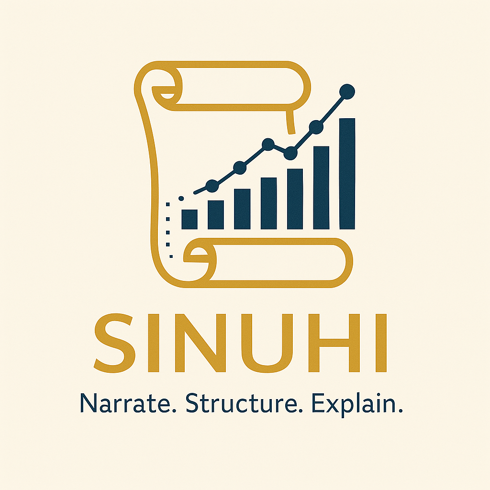

# Sinuhe
### Deciphering Your Data's Story

Sinuhe is your personal AI scribe for any SQL database. It automatically detects your database schema and empowers you to ask complex questions in plain English. Sinuhe translates your words into precise SQL, helping you explore, analyze, and understand your data without writing a single line of code.

# Vision
To transform raw data into clear narratives, providing structured queries with step-by-step explanations.

# Mission
To empower anyone, regardless of technical skill, to converse with their data. We do this by providing an intelligent layer that translates natural language into precise SQL, making data exploration intuitive and immediate.

## License

This project is distributed under the MIT License. See the [`LICENSE`](LICENSE) file for more information.